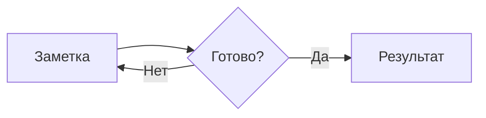
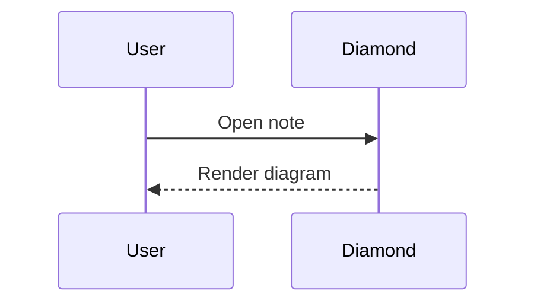
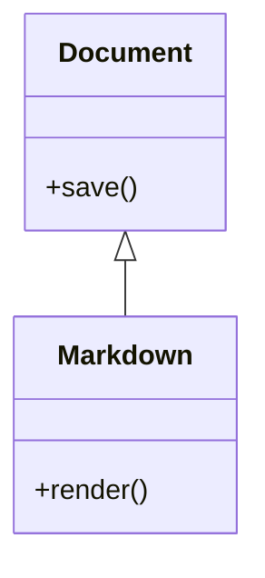

# Mermaid

```mermaid
flowchart LR
    A[Заметка] --> B{Готово?}
    B -->|Да| C[Результат]
    B -->|Нет| A
```

```mermaid
sequenceDiagram
    participant User
    participant Diamond
    User->>Diamond: Open note
    Diamond-->>User: Render diagram
```

```mermaid
classDiagram
    Document <|-- Markdown
    Document: +save()
    Markdown: +render()
```
